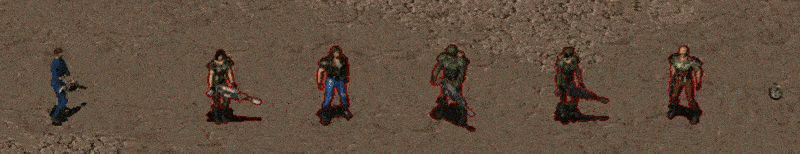
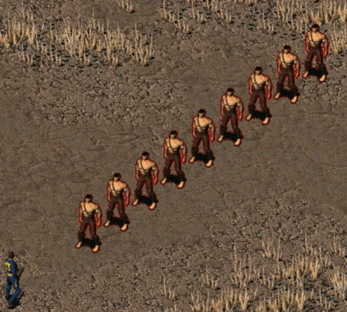
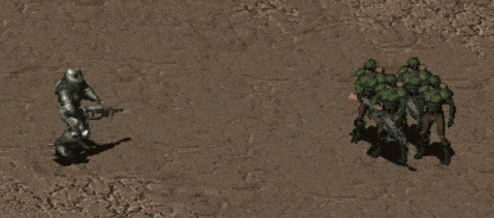
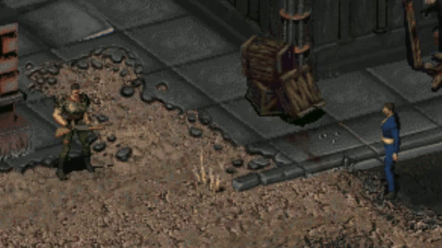
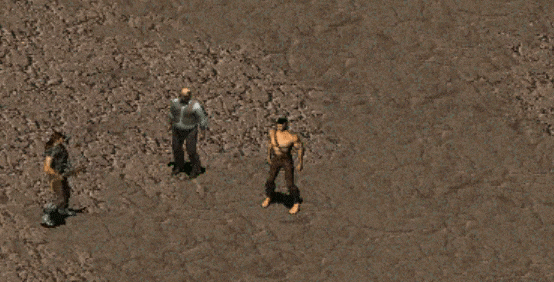
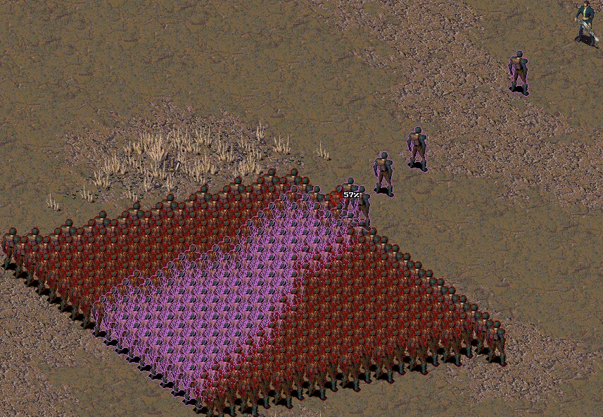
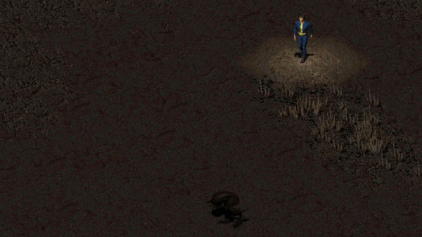
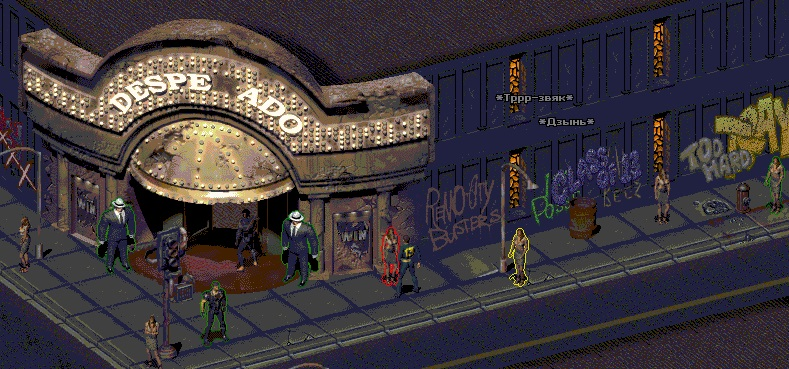

# Fallout2MechanicsMiniRework
[__Download__](https://github.com/dekrus/Fallout2MechanicsMiniRework/releases)

 This is a rework of some gameplay mechanics of Fallout 2 and games based on it.  
 
## Installation
- Download `F2MechanicsMiniRework.zip` from the [latest release](https://github.com/dekrus/Fallout2MechanicsMiniRework/releases) page.
- Unzip the archive into the main game directory. F2MechanicsMiniRework requires sfall (`ddraw.dll`) version 4.3.3+. it's shipped with the mod. If you have a newer version, you don't need to overwrite the dll when extracting the archive. 
- [SFALL v4 latest release](https://sourceforge.net/projects/sfall/files/)
- [RUS SFALL v5 latest release](https://gitflic.ru/project/fakelshub/sfall/release/c5683b53-0234-4c12-b5ae-c03b299b373a)
- Edit `mods/F2MechanicsMiniRework.ini` to enable, disable, or fine-tune components as you desire.

## Сontents
- [Mods](#mods)
- [Compatibility](#compatibility)
- [Unistallation](#uninstallation)

## Mods
- [SecondaryAttack](#secondary-attack)
- [SkillBooks](#Skill-Books)
- [Poison](#poison)
- [Healing](#healing)
- [MedToolsMod](#medical-tools)
- [Explosion injury](#explosion-injury)
- [Misses](#misses)
  - [Random bodypart hit](#random-bodypart-hit)
- [Sneak](#sneak)
  - [Sneak detection](#sneak-detection)
- [Steal](#steal)
- [Swing&Thrust](#swingthrust)
- [AntiCritical](#anticritical)
- [StealthBoy AutoSneak](#stealthboy-autosneak)
- [Stats Recalculation](#stats-recalculation)

### Secondary Attack
This module adds an alternative fire mode to Laser, Plasma and Gauss weapons.
- Alternate Fire mode is activated with an Aimed Shot to the torso.
- All animations depend on combat speed settings, and I advise you to set the maximum combat speed for better results.

Laser weapons:
  

- Laser weapons deal weapon damage (+ perks and critical effects) to all creatures in a line between the shooter and the target.
- The alternate firing mode consumes (2 + 1 * number of additional targets) microfusion cells/small energy cells.
- The maximum number of additional targets can be configured in the "F2MechanicsMiniRework.ini" file.
- Alternate mode increases armor penetration. ( All targets' laser defenses are multiplied by 0.5 )
- Hit chance and critical hit chance are calculated separately for each target.

Gauss weapons:
  

- Gauss weapons deal weapon damage (+ perks and critical effects) to all creatures in the line of fire.
- The maximum number of additional targets depends on the attacker's damage, the amount of damage reduction for each target (configurable in the "F2MechanicsMiniRework.ini" file), and the armor defenses of the targets on the line.
- Hit chance and critical hit chance are calculated separately for each target.

PLASMA weapons:
  

- Plasma weapons deal weapon damage (+ perks and critical effects) to all creatures in a radius around the main target.
- The radius of the plasma explosion is configured in the "F2MechanicsMiniRework.ini" file.
- Damage depends on the distance to the main target. The greater the distance, the lower the damage (can be configured in the "F2MechanicsMiniRework.ini" file).
- The alternate firing mode consumes 3 microfusion cells/small energy cells.
- Critical hit chance is calculated separately for each target.

Pistols & SMGs:
  

- Non-energy Pistols and SMGs allow you to fire two single shots to the body of the same target for the cost of one aimed shot.
- The first shot (an aimed body shot) requires the standard AP cost, but consumes 1 fewer AP, allowing you to fire a second (non-aimed) shot at the same target for 1 AP.
- Second shot hit chance reduced by (15 + Wpn STR req * 3), but cannot be lower than 1/3 of the initial hit chance.
- Using inventory/changing weapons/using items/moving/reloading/shooting a different target interrupts the Double Tap.

Shotguns:
  

- Aimed shots to the body knock back enemies and can knock them down.
- Affects targets closer than 10 hexes / half the weapon's maximum range.
- Heavier creatures like super mutants/robots/deathclaws/giant scorpions are knocked back less and are less likely to be knocked down.

### Skill Books
This mod allows you to use skill books on companions to increase their skills, and also allows you to change the amount of bonus skill points and the number of skills that increase when reading books.
(Compatible with F2, F2 EcCo, F1.5: Resurrection, Nevada, Sonora: Bookseller Ashley mod, Et_Tu)

- Skill books can now be applied to sentient companions to improve their skills. The bonus from reading books is retained as the companion levels up.
- The original amount of skill gain (and its maximum value) from reading books can either be increased or changed to a fixed value.
- Books can now increase up to 2 skills at the same time if you add a new skill to the "books.ini" file. All base books, and any books registered in "books.ini", will work with the mod.
- The "Comprehension" perk now increases not only the number of points received when reading, but also the skill increase limit.
- The mod also works with unique books (Fallout 2 Hintbook, Cat's Paw issue no.5, Nevada: "Homo Ludens", Neurosurgery Manual)

Additional settings that can be enabled:
- Books can be read aloud, then the skill will increase for the player and the companion to whom the player reads the book, or for the whole group at once, depending on the option chosen.
- The presence of the "Comprehension" perk for the player also works for companions.
- You can allow non sentient companions like dogs and brahmins to read books and receive a bonus from them.

 
  
 An example of how to modify the "GUN AND BULLETS" skill book to increase the "Small guns" and "Big guns" skills. 

- if the "books.ini" file is not present in your "..\Fallout 2 (or other game)\sfall\" folder, then you can take it from (https://github.com/sfall-team/sfall/blob/e703a82c8b5203919b83d99c54a5c76827818cef/artifacts/config_files/books.ini)  
- place "books.ini" along the path "..\Fallout 2 (or other game)\sfall\books.ini"  
- Now look at the example below. For changing original books "overrideVanilla=" in "books.ini" can be anything if my mod is installed.  
- "count" in "books.ini" should be equal to the number of changed and/or added books  
- in square brackets indicate [1] the sequence number of the new/modified book starting from the number "1", the order of changing/adding the book does not matter.  

### Beginning of the example  
[1]  
; book item PID ("GUNS AND BULLETS" PID = 102, Big Book of Science  = 73, First Aid Book = 80, Scout Handbook = 86, Dean's Electronics = 76, Chemistry journals (F2 and 1.5 only) = 237), for other books will have to google  
PID=102  
; textID from proto.msg which displayed when reading book("GUNS AND BULLETS" TextID = 805, Big Book of Science = 802, First Aid Book = 804, Scout Handbook=806, Dean's Electronics=803, Chemistry journals (F2 and 1.5 only)=802)  
TextID=807  
; corresponding skill (skill number in order from top to bottom starting with Small guns = 0, Big guns = 1, Energy weapons = 2, ending with "outdoorsman" skill = 17)  
; Skill=0 will increase "Small guns" by the amount set in "FixedSkillInc"  
Skill=0  
; Skill2 Added only by this mod, and only works with it.  
; Skill2=1 will increase "Big guns" by the amount set in "FixedSkill2Inc"  
Skill2=1  
### End of the example  

### Poison 
**(Requires SpeedInterfaceCounterAnims = 2" in ddraw.ini)**  
This is a rework of the original poison mechanics, designed to make it more dangerous for both the player and NPCs.

- Now not only the player takes poison damage, but all creatures without poison immunity.
- Poison damage depends on combat difficulty settings.
- Poison damage triggers at the end of each of the poisoned creature's turns in combat, or every 5 seconds when out of combat..
- If you (or NPC) accumulate more than 100 units of poison, instant death occurs.
- Now the tails of radscorpions can be used to apply poison to the player’s or Сompanions' piercing and cutting weapons.
- NPCs and Companions can apply poison to their weapons themselves if they have a radscorpion tail in their inventory.
- Added a new perk "Poison Mastery", available from level 6 and requiring science above 50 or naturalist skill above 70. This perk adds poison damage when using Needler's ammunition and also increases the effectiveness of all poisoned weapons.

### Healing 
**(Requires "SpeedInterfaceCounterAnims = 2" and "AllowUnsafeScripting = 1 or 2") in ddraw.ini)**  
Replaces instant stimpak healing with healing over time.

- Using a Stimpack increases "healing rate" for 3 rounds. To start healing, the "healing_rate" must be greater than 5.
- Super Stimpak instantly restores up to 60 HP, while temporarily reducing the "healing_rate" based on the actual HP restored. Also, Super Stimpak can heal broken limbs (if enabled in the ".ini" file).
- Fast Metabolism (trait) enhances the effect of Stimpaks and Super Stimpaks;
- Some monsters have passive health regeneration: wanamingos/centaurs (if enabled in the ".ini" file).
- Fire and Plasma damage temporarily reduces the target's regeneration rate and may even stop it completely.
- Added a new bonus perk called "Regeneration", which is automatically added if the player's base "healing rate" is greater than 5. This perk adds a "healing_rate" - based chance to heal crippled limbs when HP is restored. 

### Medical Tools
Changes the way the First Aid Kit, Doctor's Bag, and Paramedic's Bag are used.

- The use of the First Aid and Doctor skills without tools are unchanged.
- The skill boosts from the First Aid Kit and Doctor's Bag remained the same +20%, and +40% for the upgraded versions.
- Removed element of randomness in the number of uses of medical tools, now First Aid Kits and Doctor's Bag have an indicator of the remaining materials. First aid kit can be used 5 times until it is depleted, and the doctor's bag 3 times. Upgraded versions (paramedic bag) can be used up to 10 times.
- Removed the daily limit on the use of medical tools. The number of uses is limited only by the remaining supplies in The First Aid Kit/ Doctor's Bag.
- Each use of medical tools is guaranteed to restore a certain amount of health, ranging from the lowest possible (failed skill check) to the average and maximum values (successful skill check).
- The "Healer" perk adds an extra 4–10 (2–5 for et_tu) HP healed per perk level. 
- Healing HP with a First Aid Kits or Doctor's Bag does not grant experience points, but healing a disability with a doctor's bag grants 50 experience points for each limb healed.
- Healing effectiveness is capped at 300% for both types of medical tools.

FA tools:
- Can be used during combat. Also, NPCs and companions can use it. 
- Costs 2 AP.
- Healing efficiency equal to that of a stimpack is achieved at ~80% First Aid skill.

DOC tools:
- Can be used during combat if equipped and the Doctor's skill is 50 or more. Also, NPCs and companions can use it.
- Costs 6 AP. Cost decreases as skill increases. (Costs 5 AP at skill 100%, 4 AP at skill 150%, and so on up to 2 AP at skill 250%).
- The effectiveness of healing per AP/skill is higher than that of First Aid Kits. The amount of healing also depends on your maximum health and the severity of the injuries you received.
- The chance to heal an injury is calculated for each limb separately and capped at 100% ( 80% Doctor skill + 20% bonus from Doctor's Bag or 60% Doctor skill + 40% bonus Paramedics Bag).

### Explosion injury
Damage from grenades (including plasma grenades as well as EMP for robots), grenade launchers, and other explosive weapons that exceeds 15% (35% for robots or 10% with EMP) of the !current! health points can cause damage to the arms/legs/eyes.  
(The probability of cripling is configured in the ".ini" file and also depends on some S.P.E.C.I.A.L. of the target)
- An explosive hand injury can cause weapons to fall out of hand.

### Misses
Changes how misses work in a more "logical" way.

- Expanded the area for hitting a random target in the path of a bullet / throwing weapon.
- To hit the eyes and groin, it is now necessary that the target be turned to face you, now it will not work to hit the eyes by shooting in the back of the head. Successful aimed shot to the eyes while the target isn't facing the attacker will always turn into a headshot; the same happens if the target is liying face down. Instead of the groin, shots and melee hits from the back or rear will hit the torso or one of the legs.
- The position of body parts (and accordingly, the possibility of hitting them) changes depending on the animation of the target (if target lies face up or down, lies on its side, etc.)
- Misses of aimed attacks now have a small chance to hit an adjacent body part.

Example: Purple highlights new possible targets if the shot misses the initial target (crosshair).

#### Random bodypart hit
NPCs will now use aimed attacks targeting different parts of the body against the player and other NPCs.
- NPCs's aimed hit chance depends on the combat difficulty settings.
- Alternate mode for the player can also be enabled, adding a chance to hit a random body part with unaimed attacks.

### Sneak
Removes randomness from the sneak skill. Now the detection area does not depend on random dice rolls and gradually decreases with increasing skill level and the general illumination of the map.
 - Added a low light condition penalty to the NPC perception range: from 8% (basement light) to 40% (darkness).

#### Sneak detection (It is recommended to switch graphics to DirectX 9 for best performance, and also set "DontTurnOffSneakIfYouRun=1" in ddraw.ini for convenience)

Sneak detection color indication that works for the original and new stealth mechanics.
As long as the sneaking player is within the detection range of an NPC watching him, that NPC will be outlined:

- Green - Player not detected, safe to approach.
- Yellow - Player not detected, but will be detected if approaching 4 steps closer.
- Orange - Player not detected, but will be detected if approaching 1 step closer.
- Bright Red - Player has been detected.
- Dark Red - (Steal mod only) Player has been detected, but the NPC will not notice an attempt to steal from other NPCs.
- Gray   - (Fog of War disabled) Player not detected, but will be detected if line of sight becomes unblocked.

### Steal
The original mechanics of pickpocketing did not take into account the perception of the target. And also, the probability of unsuccessful pickpocketing did not depend on skill and was always the same for both 85 and 300 skill levels (approximately 15%).
The new Steal skill mechanic is an attempt to fix these "features".  

Basic moments:
- The calculation of the probability of a successful steal is similar to the original formula with the addition of dependence on the target's perception and the player's steal skill.
- If the Steal skill is developed over 140%, then for every 1 point, the maximum steal chance is increased by 0.1%, up to a maximum of 99%.
- When the skill exceeds 160 + (the target's current perception x 5), it becomes possible to steal weapons and items from the hands of the NPC.
- To peep into a target's pocket, you need to meet minimum skill requirements.
- In the case of an unsuccessful attempt to use the Steal skill, the target can sometimes become hostile. The presence of the Harmless perk significantly reduces this chance.

Modifiers that increase the skill requirement and reduce the chance of a successful pickpocket include:
- The player stands in front of the target.
- The player is seen by the target's nearby allies.
Modifiers that reduce the chance of a successful pickpocket include:
- The weight and size of the item (if the "Pickpocket" perk is not taken).
- The number of items stolen in a row.

Modifiers that reduce skill requirements and increase the chance of a successful pickpocket include:
- Sneaking mode. Bonus depends on the sneak skill level + a significant increase in the bonus if the target cannot see the player.
- Low light conditions: caves, cellars, nights, etc. — the darker it is, the easier it is to get into your pocket, adjusted for the presence of the "Night Vision" perk.
- The target is unconscious / blinded (bonus depends on the severity of the condition).

Additional settings that can be activated include:
- The first attempt to steal will always have a 100% success chance if you have reached the minimum skill level. (workaround to reduce saves/loads)
- Subsequent attempts, in order to avoid abuse of experience for stealing, will be calculated according to the formula.
- Complication of stealing items depending on their cost, the more expensive the more difficult.
- Complicated stealing from merchants.

### Swing&Thrust
With the setting enabled, swing attacks and thrusts with a knife will now have different properties.

1.Swing attack:
- Increases chance to hit based on the target's agility and the attacker's melee skill.
- On lightly armored targets, a swing attack is more likely to deal maximum damage than minimum damage.

2. Thrust attack:
- Penetrates some of the target's DR and DT based on the attacker's melee damage stat and maximum knife damage.
- Increases the base chance of a critical hit by 1.5 times.

### AntiCritical
If enabled, prevents status effects (crippling, blindness, knockout, and instant death) when receiving/dealing 0 damage on a critical hit (player and/or NPCs).

### StealthBoy AutoSneak
If enabled, Sneaking Mode is automatically applied when using a charged Stealthboy.

### Stats Recalculation
When changing the base Endurance value to a new even value (through perks and implants but not drugs), it retroactively recalculates the maximum amount of health gained from previous levels, allowing you to start the game with an odd Endurance value and later make it even without losing the progress of maximum health.

An additional option for ODD Endurance value that changes the formula for increasing health points per level.
Each point of Endurance now increases maximum health by +0.5 HP per level, rounded up every even level, instead of +1 HP per 2 points of Endurance.

When base intelligence increases (through perks and implants but not drugs), the player is given skill points according to the formula: (number of level-ups) * (intelligence - initial intelligence) * 2.

## Compatibility
* Most of the components are compatible with all "Fallout 2"-based games. Compatibility with Nevada, Sonora, or Fallout et tu can be enabled in `mods/F2MechanicsMiniRework.ini`

## Uninstallation
Delete `mods/F2MechanicsMiniRework.*` files.
