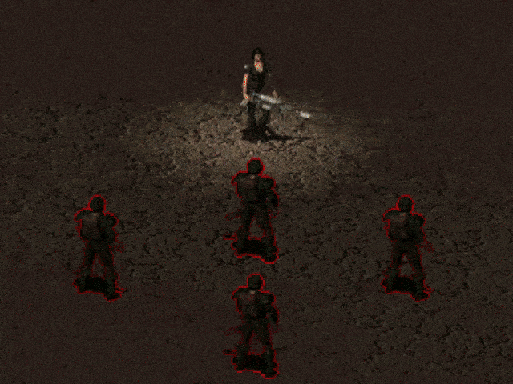
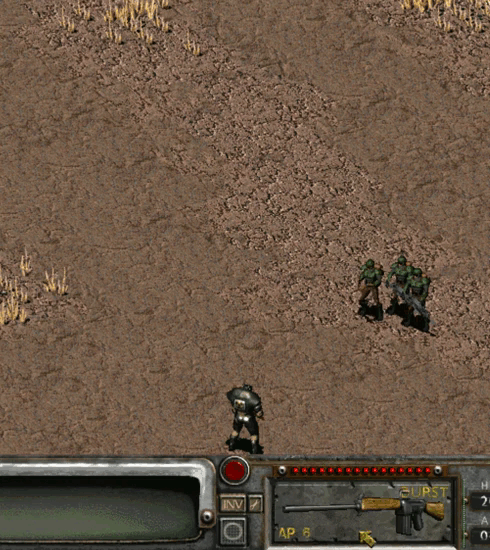

# Fallout2MechanicsMiniRework
[__Download__](https://github.com/dekrus/Fallout2MechanicsMiniRework/releases)

 This is a rework of some gameplay mechanics of Fallout 2 and games based on it.  
 [__Описание на русском__](https://github.com/dekrus/Fallout2MechanicsMiniRework/blob/main/configs/README_RUS.txt)
 

## Installation

**Requirements:**
- [SFALL v4 latest release](https://sourceforge.net/projects/sfall/files/)  
  **or**  
  [RUS SFALL v5 latest release](https://gitverse.ru/sfall_projects/sfall/releases)

**Required sfall settings in ddraw.ini:**
- `AllowUnsafeScripting=2` (for sfall 4.4+) or `AllowUnsafeScripting=1` (for sfall 5.1+)
- `SpeedInterfaceCounterAnims=2`

**Installation steps**:
1. **Download** the latest `F2MechanicsMiniRework.zip` from the [Releases page](https://github.com/dekrus/Fallout2MechanicsMiniRework/releases).
2. **Extract** the archive directly into your main Fallout game folder.
3. **Verify structure**: After extraction, you should have the following files in `Fallout/mods/`:
   - `F2MechanicsMiniRework.dat`
   - `F2MechanicsMiniRework.ini`
4. **Configure mod order**:
   - If `mods_order.txt` exists in your `mods` folder, add `F2MechanicsMiniRework.dat` anywhere in it.
5. **Customize settings**:
   - Edit `mods/F2MechanicsMiniRework.ini` to enable/disable specific features and adjust their parameters.


## Contents
- [Mods](#mods)
- [Compatibility](#compatibility)
- [Uninstallation](#uninstallation)

## Mods
- [Secondary Attack](#secondary-attack)
- [Traits Plus](#traits-plus)
- [Skill Books](#skill-books)
- [Poison](#poison)
- [Healing](#healing)
- [Medical Tools](#medical-tools)
- [Explosion injury](#explosion-injury)
- [Misses](#misses)
  - [Random bodypart hit](#random-bodypart-hit)
- [Sneak](#sneak)
  - [Sneak Detection](#sneak-detection)
- [Steal](#steal)
- [Swing & Thrust](#swing-thrust)
- [AntiCritical](#anticritical)
- [StealthBoy AutoSneak](#stealthboy-autosneak)
- [Stats Recalculation](#stats-recalculation)

### Secondary Attack
**(Requires set in ddraw.ini: AllowUnsafeScripting=2 for sfall 4.4+ or AllowUnsafeScripting=1 for sfall 5.1+)**
This module adds alternative fire modes to Laser, Plasma, Gauss, and other weapons.
- Alternate Fire activates with an Aimed Shot to the torso, or can be set to always be active (configurable).

**Laser Weapons:**   
- Damages all creatures along the projectile's path.
- Hit/critical chance calculated separately per target.
- Alternate fire has increased armor penetration (target laser defense ×0.2 — 80% ignored).
- Energy cell consumption is calculated based on potential targets between shooter and main target.
  - On a miss, the beam travels in a different direction but can still hit up to the originally calculated number of targets.
  - Beam continues until it dissipates (max weapon range), hits an obstacle, or strikes the predetermined number of targets.
- Maximum additional targets depends on weapon and ammo type, and can be configured in `F2MechanicsMiniRework.ini`.
- Alternate attack consumes (2 x base attack cost + number of additional targets х base attack cost) energy cells.

**Pulse Weapons:**  
   
- Attack animation can be either instant chain lightning or traveling arc between targets (configurable in `F2MechanicsMiniRework.ini`).
- Pulse and EMP weapons deal damage in a "chain" to up to X additional targets closest to each other.
- Maximum distance and number of additional targets configurable in `F2MechanicsMiniRework.ini`.
- Alternate fire consumes 3 microfusion/small energy cells.
- Lightning cannot miss secondary targets once triggered and can hit the attacker if too close.
- Lightning deals highly randomized damage to secondary targets, decreasing with each target.
- Critical chance calculated separately per target.
- Alternate attack consumes (2 x base attack cost, but no less than 3) energy cells.

**Gauss Weapons:**   
- An armor-penetrating attack that ignores 80% of a target's armor.
- Can hit multiple targets in a straight line; maximum penetration depends on:
  - Weapon damage (including perk modifiers).
  - Per-target damage reduction (percentage based on target's armor).
- Hit and critical chance calculated separately for each target.
- No extra ammo cost for alternate fire.
- Insufficient Strength can knock the attacker down.

**Plasma Weapons:**   
- Creates an explosion that damages all creatures within a configurable radius.
- Damage falls off with distance from the blast center (configurable rate).
- Alternate fire consumes 3 microfusion/small energy cells.
- Critical chance calculated separately for each target.
- Alternate attack consumes (2 x base attack cost, but no less than 3) energy cells.

**Pistols & SMGs:**
  
- Non-energy Pistols and SMGs allow you to fire two single shots to the body of the same target for the cost of one aimed shot.
- Second shot hit chance reduced by (15 + Wpn STR req * 3), but cannot be lower than 1/2 of the initial hit chance.

**Shotguns:**

- Aimed shots to the body knock back enemies and can knock them down.
- Affects targets closer than 10 hexes / half the weapon's maximum range.
- Heavier creatures like super mutants/robots/deathclaws/giant scorpions are knocked back less and are less likely to be knocked down.

**Assault Rifles:**
  
- Added aimed burst fire mode for assault rifles
- Bullet spread cone adjusts dynamically based on distance, skill, stats, and perks, determining how many bullets fly directly to the aim point
- Hit chance shown is for the first bullet; subsequent bullets have progressively lower hit chance but can still hit the target's torso if the first misses the aimed body part
- Optional: Can be enabled for other burst-fire weapons like Minigun and Flamer


### Traits Plus
**(Requires set in ddraw.ini: AllowUnsafeScripting=2 for sfall 4.4+ or AllowUnsafeScripting=1 for sfall 5.1+)**
When you first launch the game after installing the mod, you need to load any saved game for the new trait descriptions to take effect.

Enhances base starting traits with new properties without altering their core mechanics.  
All new trait properties are scripted and will function even if the traits themselves have been modified by the player or other mods.  
Each new property for a specific trait can be enabled, disabled, or forcibly activated, even if the player does not possess the trait, when the option is enabled in the .ini settings file.  

**Fast Metabolism:**
- [+] All food and chems remove 33% more poison and radiation.
- [±] All food and chems heal/remove 33% more HP.
- [±] All food and chems take effect and wear off twice as fast.
- [±] If the Healing mod is enabled, HP regeneration is increased by 33%. However, if poisoned, effectiveness is reduced by 50% (higher poison resistance reduces this penalty).

**Bruiser:**
- [+] Maximum damage from unarmed, melee, and throwing weapons (excluding grenades) is doubled.
- [+] The "Melee Damage" attribute now affects the maximum damage of throwing weapons.

**One-Hander:**
- [+] One-handed unarmed attacks receive a +20% hit chance bonus.
- [+] Can attack with one-handed weapons even when both arms are injured (the +20% hit chance bonus does not apply in this case).
- [+] Bonus: +5 to critical effect power.
- [+] +3 Strength bonus for one-handed weapon requirement checks (does not affect melee weapon damage).

**Finesse:**
- [+] Player's area damage attacks can now deal critical damage, penetrate armor, and knock down/out additional targets.
- [+] Affects all types of area attacks: burst fire, grenades, flamethrowers, and alternative fire modes.

**Kamikaze:** *(Compatible with "AutoMoveToAttack" in sfall 5.0+)*
- [+] Player can "attack on the move", reducing attack cost by 1 AP per 2 steps (minimum 1 AP for non-targeted, 2 AP for targeted attacks).
- [+] Sequence increased by 10.
- [−] Each step reduces hit chance by 3%. Hit penalty and AP reduction bonus reset to zero after attacking, performing other actions (looting, using items, etc.), or at the end of the turn.

**Heavy-Handed:**
- [+] "Melee Damage" is added to minimum damage for unarmed, melee, and thrown weapon attacks (excluding grenades).
- [+] The "Melee Damage" attribute now also affects the damage of throwing weapons.
- [+] Non-critical melee/throwing attacks have a chance to knock down targets (based on damage, Strength, weapon weight, target's Endurance and species).
- [+] Player's critical miss severity reduced by 30%.

**Bloody Mess:**
- [+] First kill each turn restores 2 AP; subsequent kills in same turn restore 1 AP.
- [±] Critical miss severity increased by 30% for everyone (including player).
- [±] Player now always dies in the most gruesome way possible.

**Jinxed:**
- [±] Reduces maximum hit chance by 5% for both players and NPCs.
- [±] Time limit removed — critical misses can occur from the start of the game.

**Chem Reliant:**
- [±] Chem/food effects on stats amplified by 50%, rounded to the nearest integer (-1 → -2, +1 → +2)

**Chem Resistant:**
- [+] Food and chems no longer cause addiction.
- [+] Stats return to normal immediately after the first chem/food effect wears off.
- [+] Can take 50% more doses, rounded up.
- [±] Positive and negative effects of chems and food reduced by 50%, rounded toward zero:
  - Negative values become less negative (-3 → -1, -1 → 0)
  - Positive values round up (+1 → +1, +2 → +3)

**Skilled:**
- [+] Increases maximum hit chance by 4%.
- [+] 50% chance for the player's critical miss to become a regular miss.
- [+] Reduces perk level requirement by 4 (e.g., a level 9 perk becomes available at level 5, a level 12 perk at level 8).

### Skill Books
This mod allows you to use skill books on companions to increase their skills, and also allows you to change the amount of bonus skill points and the number of skills that increase when reading books.

- Skill books can now be applied to sentient NPCs to improve their skills. The bonus from reading books is retained as the companion levels up.
- The original amount of skill gain (and its maximum value) from reading books can either be increased or changed to a fixed value in the `.ini` file.
- Books can now increase up to 2 skills at the same time if you add a new skill to the `books.ini` file. All base books, and any books registered in `books.ini`, will work with this mod.
- The "Comprehension" perk now increases not only the number of points received when reading, but also the maximum skill increase limit.
- The mod also works with unique books (Fallout 2 Hintbook, Cat's Paw issue no. 5, Nevada: "Homo Ludens", Neurosurgery Manual, "Chryslus Motors" Catalogue, Sonora: Bookseller Ashley mod books, comic-magazine).

Additional settings that can be enabled:
- Books can be read aloud, applying skill bonuses to the reader and nearby characters (configurable).
- Optionally: The player's "Comprehension" perk can also apply to NPCs.
- Optionally: Non-sentient companions (dogs, brahmins) can be allowed to benefit from books.

<details> 
  <summary>Example: Modifying the "GUNS AND BULLETS" skill book to increase both "Small Guns" and "Big Guns" skills.</summary>

If the `books.ini` file is not present in your game folder, you can download it from the [SFALL 4 repository](https://github.com/sfall-team/sfall/blob/e703a82c8b5203919b83d99c54a5c76827818cef/artifacts/config_files/books.ini).

**Important notes:**  
- `overrideVanilla=` in `books.ini` can be any value when this mod is installed.  
- `count` in `books.ini` must equal the total number of modified and/or added books.  
- Books are referenced in square brackets `[1]`, `[2]`, etc. The order does not matter, but numbering starts from `1`.  

### Configuration Example  
[1]
; Book item PID
; ("GUNS AND BULLETS" PID = 102, Big Book of Science = 73, First Aid Book = 80,
; Scout Handbook = 86, Dean's Electronics = 76, Chemistry journals (F2 and Resurrection only) = 237)
; For other books, you will need to search online.
PID=102

; TextID from proto.msg displayed when reading the book
; ("GUNS AND BULLETS" TextID = 805, Big Book of Science = 802, First Aid Book = 804,
; Scout Handbook = 806, Dean's Electronics = 803, Chemistry journals (F2 and F:Resurrection only) = 802)
TextID=805

; Primary skill to increase (skill numbers from 0 to 17):
; 0 = Small Guns, 1 = Big Guns, 2 = Energy Weapons ... 17 = Outdoorsman
; Skill=0 will increase "Small Guns" by the value set in "FixedSkillInc"
Skill=0

; Secondary skill (Skill2) – added by this mod only
; Skill2=1 will increase "Big Guns" by the value set in "FixedSkill2Inc"
Skill2=1
</details>

### Poison
**(Requires set in ddraw.ini: SpeedInterfaceCounterAnims=2)**  
**(Requires set in ddraw.ini: AllowUnsafeScripting=2 for sfall 4.4+ or AllowUnsafeScripting=1 for sfall 5.1+)**
This is a rework of the original poison mechanics, designed to make poison more dangerous for both the player and NPCs.

- Poison damage now affects not only the player, but all creatures without poison immunity.
- Poison damage scales with combat difficulty settings.
- Poison damage triggers at the end of each poisoned creature's turn in combat, or every 5 seconds when out of combat (configurable in the `.ini` file).
- If you (or an NPC) accumulate more than 100 units of poison, instant death occurs (configurable in the `.ini` file).
- Radscorpion tails can now be used to apply poison to the player's or companions’ piercing and cutting weapons (additional weapon PIDs can be specified in the `.ini` file).
- NPCs and companions can apply poison to their own weapons if they have a radscorpion tail in their inventory.
- When poisoned, NPCs and companions can use an antidote (or other healing items) if available in their inventory. They can do so during combat, out of combat, while traveling on the world map, and while resting.
- Added a new perk, **"Toxicologist"**, available from level 6 and requiring Science above 50% or Outdoorsman above 70%. This perk adds poison damage when using Needler pistol, increases the effectiveness of all poisoned weapons, and raises your poison resistance cap to 100%.

### Healing
**(Requires set in ddraw.ini: SpeedInterfaceCounterAnims=2)**  
**(Requires set in ddraw.ini: AllowUnsafeScripting=2 for sfall 4.4+ or AllowUnsafeScripting=1 for sfall 5.1+)**
Replaces instant Stimpak healing with healing over time.

- All creatures with a Healing Rate of 6 or higher begin to regenerate a portion of their HP at the end of their turn in combat, or every 5 seconds when out of combat (configurable in the `.ini` file).
- Using a Stimpak increases the Healing Rate for 15 seconds (3 rounds). Afterwards, a penalty is applied to the Healing Rate to prevent Stimpak abuse.
- The Super Stimpak instantly restores HP based on the target’s maximum HP and current Healing Rate, but not less than 60 HP, while temporarily reducing the Healing Rate (depending on the actual HP restored). The delayed damage from the Super Stimpak is proportional to the amount of HP actually restored and the difference between the Healing Rate and the applied penalty.
  - Additionally, if enabled in the `.ini` file, the Super Stimpak can heal crippled limbs at the cost of increased post-effect damage.
- The Fast Metabolism trait enhances the effects of Stimpaks and Super Stimpaks if **Traits Plus** is enabled.
- Wanamingos and centaurs have passive HP regeneration (configurable in the `.ini` file).
- Certain damage types (laser, plasma, explosion, fire, and electricity) can apply a **Burn** status effect, which temporarily reduces the target’s Healing Rate and some stats until fully healed.
- Added a new bonus perk, **"Regeneration"**, which is automatically granted if the player's base Healing Rate is greater than 5. This perk provides a Healing Rate–based chance to heal crippled limbs whenever HP is restored.

### Medical Tools
Changes the way the First Aid Kits, Doctor's Bag, and others medical tools are used.

- Using First Aid and Doctor skills without tools remains unchanged.
- Skill boosts from the First Aid Kit and Doctor's Bag remain the same: +20%, and +40% for upgraded versions.
- Removed the random number of uses from medical tools. First Aid Kits and Doctor's Bags now have a supply indicator showing remaining supplies. A First Aid Kit can be used 5 times before depletion, and a Doctor's Bag 3 times. Upgraded versions (Paramedic's Bag) can be used up to 10 times.
- Removed the daily usage limit for medical tools. The number of uses is now limited only by the remaining supplies in the kit/bag.
- Each use of medical tools guarantees some HP heal, ranging from the minimum (failed skill check) to average or maximum values (successful skill check).
- The "Healer" perk adds an extra 4–10 HP healed per perk level (2–5 HP for Fallout et tu).
- Healing HP with a First Aid Kit or Doctor's Bag does not grant experience points, but healing a crippled limb with a Doctor's Bag grants 50 XP per limb healed.
- Healing effectiveness for all medical tools is capped at 300% of the corresponding skill.

**First Aid Kit:**
- Can be used during combat. NPCs and companions can also use it.
- Costs 2 AP.
- Healing efficiency equal to a Stimpak is achieved at ~80% First Aid skill.

**Doctor's Bag:**
- Can be used during combat if equipped in hands and with at least 50 Doctor skill. NPCs and companions can also use it.
- Costs 6 AP initially. AP cost decreases with higher skill: 5 AP at 100% skill, 4 AP at 150%, down to 2 AP at 250%.
- Healing per AP/skill is higher than with First Aid Kits. Healing amount also depends on your maximum HP and injury severity.
- Chance to heal a crippled limb is calculated per limb separately, capped at 100% (80% Doctor skill + 20% Doctor's Bag bonus, or 60% skill + 40% Paramedic's Bag bonus).

### Explosion injury
Damage from grenades (including plasma grenades and EMP damage for robots), grenade launchers, and other explosive weapons that exceeds 15% (35% for robots, or 10% when damaged by EMP) of the target's **current** HP can cripple arms, legs, or eyes.  
*(The probability of crippling is configurable in the `.ini` file and also depends on some of the target's S.P.E.C.I.A.L. stats)*
- An explosive injury to the hand can cause weapons to be dropped.

### Misses
Changes how misses work in a more "logical" way.
- Expands the area for hitting a random target in the path of a bullet/throwing weapon *(the miss cone width decreases as skill level increases)*
- To hit the eyes or groin, the target must now be facing you - you can no longer hit the eyes by shooting the back of the head. Successful aimed shots to the eyes while the target isn't facing the attacker become headshots; the same applies if the target is lying face down. Instead of the groin, shots and melee hits from behind will hit the torso or one of the legs.
	- The position of body parts (and accordingly, the possibility of hitting them) changes depending on the target's animation (if they lie face up or down, on their side, etc.)
- Missed aimed attacks now have a small chance to hit an adjacent body part.

*Example:* Purple highlights show potential alternate targets if the shot misses the initial target (crosshair) — this is for visualization only and does not appear in-game.


#### Random Bodypart Hit
NPCs now can perform aimed attacks targeting specific body parts against the player and other NPCs.
- NPCs' aimed hit chance is influenced by combat difficulty settings.
- An optional mode can be enabled, adding a chance for the player's unaimed attacks to hit random body parts.

### Sneak
Removes randomness from sneaking. Detection is now determined by skill level and local lighting (e.g., flares, lanterns, campfires and dark corners), not by random "2-sided" dice rolls.

#### Sneak Detection 
*(Recommended: set "DontTurnOffSneakIfYouRun=1" in ddraw.ini for convenience)*
  
Color-coded sneak detection compatible with both vanilla and overhauled sneak systems.
While a sneaking player is within an observing NPC's line of sight, that NPC will be highlighted with one of the following colors:
- **Green** — Player not detected; safe to approach
- **Yellow** — Player not detected, but will be detected if moving 4 steps closer
- **Orange** — Player not detected, but will be detected if moving 1 step closer
- **Bright Red** — Player has been detected
- **Dark Red** — *(Steal mod only)* Player has been detected, but the NPC will not notice attempts to steal from other NPCs
- **Gray** — *(Fog of War disabled)* Player not detected, but will be detected if line of sight becomes unobstructed

### Steal
**(Requires set in ddraw.ini: SpeedInterfaceCounterAnims=2)**  
**(Requires set in ddraw.ini: AllowUnsafeScripting=2 for sfall 4.4+ or AllowUnsafeScripting=1 for sfall 5.1+)**
Overhauls vanilla's pickpocketing where target perception was ignored, high steal skill didn't affect success chance, and one failed attempt would make the entire town hostile.

**New Features:**
- Shows steal chance when hovering over items
  - For stacks: displays optimal quantity (right-click for other amounts)
  - Right-click 0% items to see skill requirements
- Failure chance depends on player's skill, environment, and target's perception — not target's steal skill like in vanilla
- Failed attempts trigger scripted scenes instead of city-wide battles
- Temporary reputation/speech/barter penalties that fade over time  
  *(Avoided if steal target and all witnesses are eliminated quickly)*
- Can steal items from hand when skill > 155 + (target's Perception × 5)
- View pocket contents with skill requirement (failures may anger target)
- **Increase success chance:** sneaking, darkness, unconscious/blinded targets (and others)
- **Reduce success chance:** being seen, item weight/size, consecutive attempts (and others)
- Skill >140% increases max success chance (up to 99% at 200 skill)

### Swing & Thrust
Adds unique properties to different attack types:

**Knives:**
- **Swing:**
  - Higher hit chance (based on target's Agility & attacker's Melee skill)
  - Favors maximum damage over minimum damage against lightly armored targets
- **Thrust:**
  - Partially ignores target's DR/DT (based on attacker's melee damage & weapon max damage)
  - ×1.5 critical hit chance

**Sledgehammers, Clubs, Cattle Prods:**
- **Swing:**
  - Replaces knockback with knockdown chance (based on damage dealt)
- **Thrust:**
  - Increased attack range
  - **Collision damage:** Up to 40% bonus damage when targets are knocked into or pinned to walls/objects/creatures

### AntiCritical
- Stops crippling/blindness/knockout/death effects from critical hits that deal 0 damage (player & NPCs).

### StealthBoy AutoSneak
- Auto-activates sneaking mode when using a charged Stealth Boy.

### Stats Recalculation
**Endurance & Health:**
- HP now recalculates when base Endurance increases (via perks/implants).
- **Optional:** Fixes vanilla issue where odd Endurance values provided no benefit.
  - Odd Endurance gives **+0.5 HP/level**, rounding up on even levels.  
    *Example: Odd Endurance 1 → bonus +1 MAX HP on level 2, No HP bonus on level 3, bonus +1 MAX HP on level 4, No HP bonus on level 5, alternating*

**Intelligence & Skill Points:**
- When base Intelligence increases (via perks/implants), receive retroactive skill points:
	*Bonus = (Current Level - 1) × (Intelligence Increase) × 2*
- No points are deducted if Intelligence decreases later

## Compatibility
- Compatible with most Fallout 2-based games. Compatibility with Nevada, Sonora, or Fallout et tu can be enabled in `mods/F2MechanicsMiniRework.ini`  
- Fully compatible with [__FO2Tweaks__](https://github.com/BGforgeNet/FO2tweaks) and [__Fallout 2: Weapons Redone 2.3d__](https://www.nma-fallout.com/resources/fallout-2-weapons-redone.72/).
- All components except for the [Steal](#steal), [Healing](#healing) and [MedToolsMod](#medical-tools) are compatible with [__EcCo__](https://github.com/phobos2077/fo2_ecco/tree/master) for Fallout 2.  
## Setting up compatibility with EcCo
**Automatic conflict detection:**
- When launching the game and starting a **new game** or **loading any save**, this mod will automatically detect conflicts with EcCo and show prompts allowing you to choose which features to keep active.
**Or configure manually:**
#### Healing Mod
**Tweaks are NOT compatible - you must choose which to use:**
**Option 1:** Use EcCo's healing drugs tweaks
- In `mods/F2MechanicsMiniRework.ini` set:
    ```
    [MAIN]
    RegenMod=0
    ```
**Option 2:** Use F2MechanicsMiniRework's regen system
- In `mods/ecco/misc.ini` set:
    ```
    [HEALING_DRUGS]
    healing_skill_max=0
    ```
#### Medical Tools Mod
**Option 1:** Use EcCo's medical skills tweaks
- In `mods/F2MechanicsMiniRework.ini` set:
    ```
    [MAIN]
    MedToolsMod=0
    ```
**Option 2:** Use F2MechanicsMiniRework's medical tools mod
- In `mods/ecco/misc.ini` set:
    ```    
    [HEALING_SKILLS]
    skill_use_mod=0
    skill_item_91=0
    skill_item_47=0
    skill_item_409=0
    skill_item_408=0
    ```   

#### Steal Mod
**Choose your preferred configuration:**
**Option 1: Full compatibility** (use only one mod)
- In `mods/F2MechanicsMiniRework.ini`:
    ```   
[MAIN]
StealRebalance=0
    ```   
*or*
- In `mods/ecco/misc.ini`:
    ```   
[STEAL]
enable_tweaks=0
    ```   
**Option 2: Partial compatibility** (mix features)
- In `mods/F2MechanicsMiniRework.ini`:
    ```   
[MAIN]
StealRebalance=1
FO2_ECCO=1
    ```   
- This keeps specific F2MechanicsMiniRework features:
	- Stealing items from NPCs' hands (when skill > 155 + Perception×5)
	- Pocket peeking with skill requirements
	- *(Other steal mechanics will use EcCo's tweaks)*


## Uninstallation
**Simple method** (if you haven't started a new game with the mod):
- Delete both files from the `mods/` folder:
  - `F2MechanicsMiniRework.dat`
  - `F2MechanicsMiniRework.ini`
  
**Safe method** (recommended if you've played with the mod):
1. First, delete only `mods/F2MechanicsMiniRework.ini`
2. Launch the game and load your save
3. **Save the game** in a new slot
4. Exit the game
5. Now delete `mods/F2MechanicsMiniRework.dat`
**Note:** This safe procedure ensures that any temporary mod data is properly cleared from your save file before completely removing the mod.
